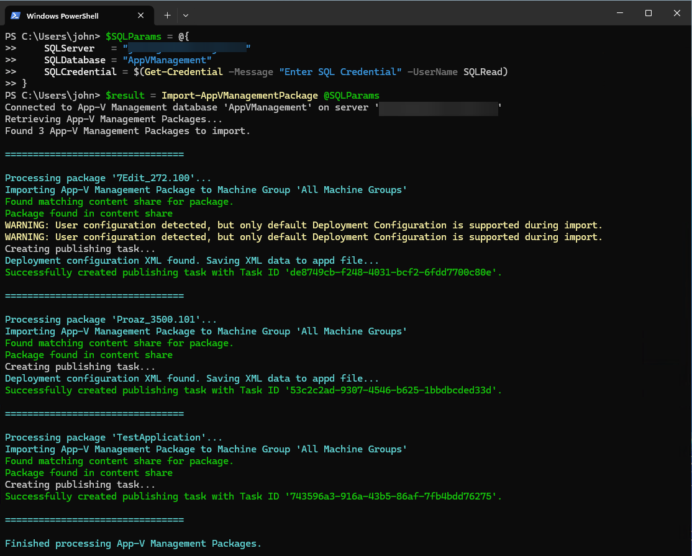
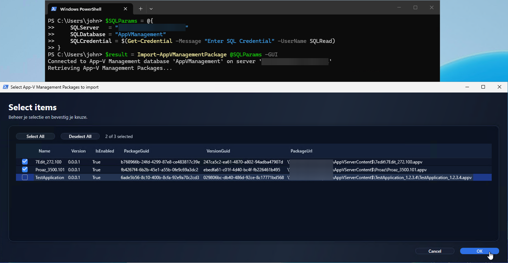
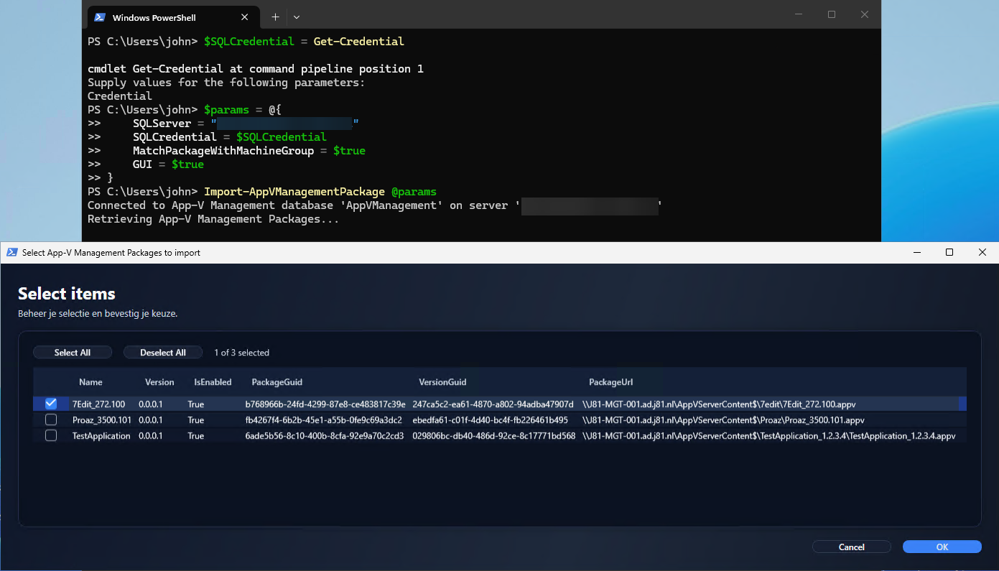
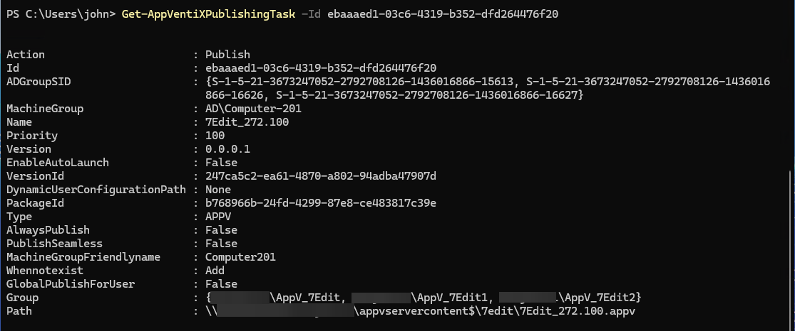

# HowTo: Import packages from App-V Management Database

This guide walks you through the process of importing your existing App-V packages from the Microsoft App-V Management Server database into AppVentiX.

## Prerequisites

Before you begin, ensure you have:

- AppVentiX PowerShell module installed and configured
- Network access to the SQL Server hosting the App-V Management database
- Appropriate permissions to read from the App-V Management database
- Content shares already configured in AppVentiX (Machine Groups) that match your App-V package locations

## Step 1: Verify AppVentiX Configuration

First, ensure your AppVentiX environment is properly configured:

```powershell
# Install the (latest) module
Install-Module AppVentiX [-Scope CurrentUser] [-Force] [-AllowClobber]

# Import the module
Import-Module AppVentiX

# (Optional) Verify connection to config share
Get-AppVentiXConfigShare

# (Optional) Verify your license is valid
Test-AppVentiXIsLicensed

# If custom credentials are required, you can run the following command to connect
# E.g. if the current user does not have permissions to access the config share

$Credential = Get-Credential -Message "Enter AppVentiX Config Share credentials"
$ConfigShare = "\\fileserver.domain.local\config$"
Set-AppVentiXConfigShare -ConfigShare $ConfigShare -Credential $Credential

# If Separate Credentials are required for communication with Active Directory, you must specify this beforehand.

$ADCredential = Get-Credential -Message "Enter Active Directory credentials"
$ADDomainController = "dc01.domain.local"
Set-AppVentiXADCredential -Credential $ADCredential -Server $ADDomainController [-Port <389/636>]

```

## Step 2: Identify Your SQL Server Details

Gather the following information about your App-V Management Server:

| Information | Example | Description |
|-------------|---------|-------------|
| SQL Server | `sql01.domain.local` | Hostname or IP of the SQL Server |
| Database Name | `AppVManagement` | Name of the App-V database (default: AppVManagement) |
| SQL Instance | `MSSQLSERVER` | Optional SQL Instance name (leave empty for default instance) |
| SQL Credentials | `SQLRead` | Optional if you current user does not have permissions, Read Only is enough |

## Step 3: Test Database Connectivity

Before importing, verify you can connect to the database:

```powershell
# Test connection using Windows Authentication
$connectionParams = @{
    SQLServer = "sql01.domain.local"
}

# Or with a named instance
$connectionParams = @{
    SQLServer = "sql01.domain.local"
    SQLInstance = "APPV"
    SQLDatabase = "AppVManagement"
}
```

## Step 4: Import Packages

### Option A: Import All Packages (Automated)

To import all enabled packages automatically and publishing to 'All Machine Groups':

```powershell
Import-AppVManagementPackage -SQLServer "sql01.domain.local"
```




### Option B: Import Selected Packages (GUI)

For more control over which packages to import, use the GUI mode. The published task IDs will be returned in the output:

```powershell
$result = Import-AppVManagementPackage -SQLServer "sql01.domain.local" -GUI

$result | Out-String

Name           Id
----           --
7Edit_272.100  ebaaaed1-03c6-4319-b352-dfd264476f20
Proaz_3500.101 b963da39-a7bc-4406-a7c4-e1e4a876b4e8
```

This opens a dialog where you can select specific packages to import:



### Option C: Import with Machine Group Matching

To automatically assign packages to the correct machine groups based on their content share location and with explicit SQL credentials:

```powershell
$SQLCredential = Get-Credential -Message "Enter SQL Server credentials"
$result = Import-AppVManagementPackage -SQLServer "sql01.domain.local" -SQLCredential $SQLCredential -MatchPackageWithMachineGroup  -GUI

```

Or the same command while using splatting:

```powershell
$SQLCredential = Get-Credential -Message "Enter SQL Server credentials"
$params = @{
    SQLServer = "sql01.domain.local"
    SQLCredential = $SQLCredential
    MatchPackageWithMachineGroup = $true
    GUI = $true
}
Import-AppVManagementPackage @params
```



## Step 5: Verify the Import

After importing, verify your packages are correctly configured:

```powershell
# List all publishing tasks
Get-AppVentiXPublishingTask

# To get all publishing tasks from the previous step, saved in the `$result` variable
$result | ForEach-Object {$_ | Get-AppVentiXPublishingTask}

# List a publisning task by id
Get-AppVentiXPublishingTask -Id ebaaaed1-03c6-4319-b352-dfd264476f20

```


You can also verify the imported packages (publishing tasks) in the AppVentiX Console.
On the tab "Packages" click "All Publishing Tasks" to see all, including the newly added publishing tasks.


## Common Issues and Solutions

### Issue: Package not found in content share

**Symptom:** Import reports that a package cannot be found.

**Solution:** Ensure the content share path is accessible and the package files exist at the expected location. Verify the content share is configured in AppVentiX.

### Issue: Authentication failed

**Symptom:** Cannot connect to the SQL Server.

**Solution:**
1. Verify network connectivity to the SQL Server
2. Check firewall rules allow SQL connections (port 1433)
3. Confirm your account has read permissions on the database
4. Try using SQL Server Authentication with explicit credentials

### Issue: No packages imported

**Symptom:** Import completes but no packages appear.

**Solution:** Only enabled packages with valid UNC paths are imported. Check the App-V Management Console to verify packages are enabled and have valid content paths.

## Best Practices

1. **Test First:** Always use the `-GUI` parameter initially to review which packages will be imported
2. **Verify Content Shares:** Ensure all content shares are configured in AppVentiX before importing
3. **Import in Batches:** For large environments, consider importing packages in smaller batches

## Next Steps

After importing packages, you may want to:

- [Import Connection Groups](Import-AppVManagementConnectionGroup.html) to maintain application dependencies
- Review and adjust publishing task settings in the AppVentiX Console
- Test package delivery on a pilot group of machines

## Related Commands

- [Import-AppVManagementPackage](../appventix-commands/Import-AppVManagementPackage.html) - Command reference
- [Import-AppVManagementConnectionGroup](../appventix-commands/Import-AppVManagementConnectionGroup.html) - Import connection groups
